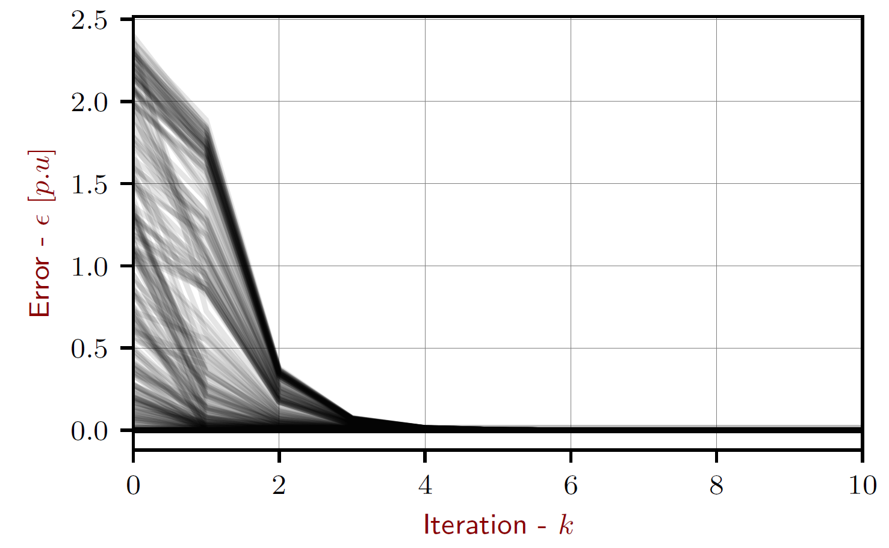

Extended controls library
=========================

Although OpenDSS has numerous control implementations in its internal equipment library (e.g. inverter controller, storage controller), these controller implementations are limited to a few control modes and may not mimic the behavior of the actual system we are modeling. For example, The OpenDSS storage controller is not capable of operating in ’capacity firming’ or ’base loading’ mode that many utility scale storage systems use. To facilitate implementation of new control modes and ensure that these controls converge to a steady state solution at each time step, an iterative convergence algorithm has been implemented within the PyDSS architecture. The convergence loop uses the steepest gradient descent with Heavy Ball optimization method to efficiently converge to a steady state solution. Heavy Ball optimization is a two step iterative method that uses the state of the previous iteration to maintain momentum in the same direction. The momentum term 

.. math:: 

	(x_{k}^{t,n} - x_{k-1}^{t,n}) 

( helps mitigate zigzag trajectories in iterative descent algorithms, thus enabling faster convergence rates. The transition equation for each controller can be formulated as:

.. math:: 

	x_{k+1}^{t,n} = x_{k}^{t,n} - \alpha^n . \bigtriangledown f(x_{k}^{t,n}) + \beta^n . (x_{k}^{t,n} - x_{k-1}^{t,n})

Each new controller implementation is a pyController object within PyDSS and controls one or more OpenDSS elements. The architecture allows users to implement there own controllers and add them to the simulation environment with minimal coding effort. Figure below presents a flow chart for a simulation run in PyDSS.

.. figure::  _static/Flow_chart.png
   :scale:   50%
   :align:   center
   
The installation come with several control listed below.

- Fault controller (Induces a fault ona chosen bus. Used in dynamic simulations)
- Pv controller (Developed for controlling the OpenDSS PVSystem element.)
	+ Volt / Var implementation
	+ Volt / Watt implementation
	+ Constant power factor implmentation
- Pv controller [Gen] (Developed for controlling the OpenDSS Generator element.)
	+ Complete IEEE1547-2018 voltage ridethrough implementation. 
- Socket controller (Enables socket interafce for PyDSS objects)
- Storage controller (Developed for controlling the OpenDSS Storage element.)
	+ Time of use control implementation
	+ Demand charge control implementation
	+ Self consumption control implementation
	+ Peak shaving / base loading control implementation
	+ Capacity firming control implementation
	+ Smart self consumption implementation
- Xfmr controller
	+ Enables tap lock in reverse power flow conditions.

pyControllers need to be defined within the 'pyControllerList.json' file for a given scenario. All pyController may be disabled by setting the to 'true' in the 'Scenario_settings.TOML' file.

.. code-block:: python
	
	"Disable PyDSS controllers" = false
	
Error tolerance and maximum controll interations for pyController object can also be defined in the 'Scenario_settings.TOML' file by setting appropriate value for the following keys.

.. code-block:: python
	
	"Max Control Iterations" = 15
	"Error tolerance" = 0.001
	
Controller convergance (and instances of failed convergance) are reported  in the log file. The log file also contains a summary convergance report at the end of a simulation. The figure below shows a convergance plot for the PV controller implemented in PyDSS. Each trace shows convergance path at a single time step.

Expected definations for each controller can be found here 

.. toctree::
   :maxdepth: 2 
  
   PyDSS controllers

   
Users are able to extend current control implementations by following the tutorial here

.. toctree::
   :maxdepth: 2 
  
   Creating custom controls

