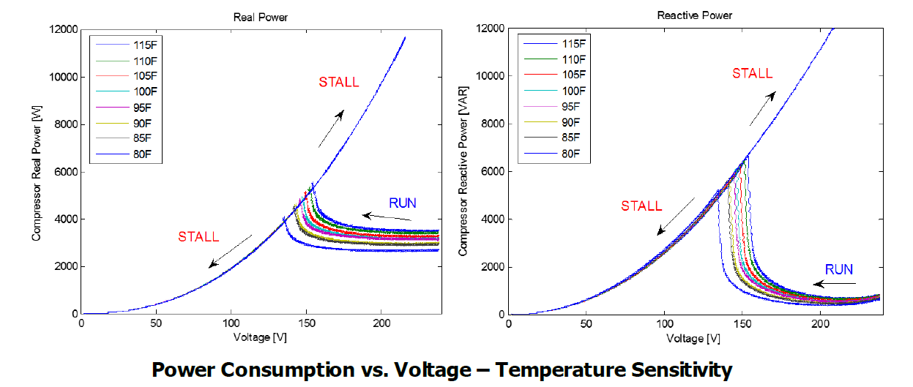
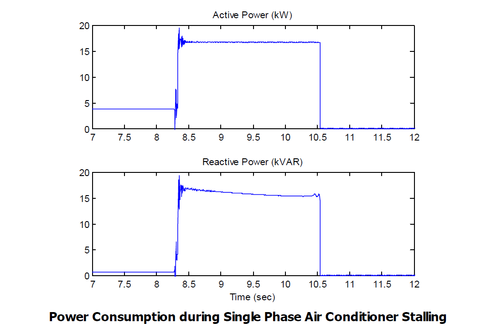

*****************
Motor Stall Model
*****************

Controller overview
-------------------

This controller implments the motor stall model for single phase motors (residential air conditioners) and models two states of operations 
i.e.  run state and stall state. As supply voltage is
decreased, the motor slowly begins to consume a higher amount of active and reactive power. At some voltage
level (“stall voltage”), the supply voltage is no longer adequate to maintain stable motor operation and the motor
“stalls” (stops). There is insufficient motor torque to overcome the load torque and therefore the motor stalls.
Head pressure is built up in the compressor, so the motor is unable to reaccelerate until that pressure is reduced.
At this point, the motor draws extremely high amounts of current particularly when the voltage recovers to normal operating level. 
This is because once the motor stops (stalls), its electrical behavior is essentially that of a resistive plus inductive load 
(i.e., a shunt reactor to ground). Ambient temperature also plays a clear role in stall characteristic. 

Controller model
----------------

.. autopydantic_model:: pydss.pyControllers.models.MotorStallSettings

Usage example
-------------