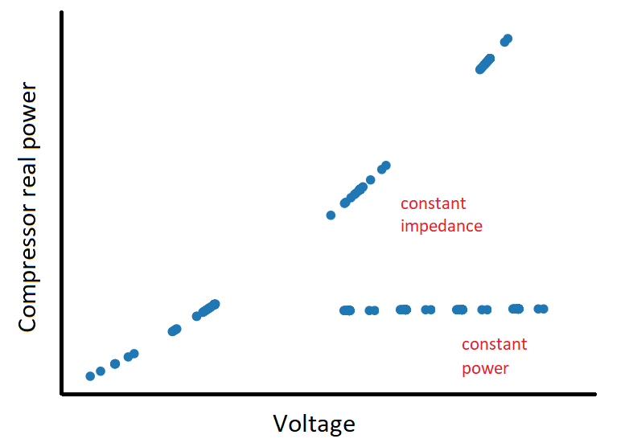
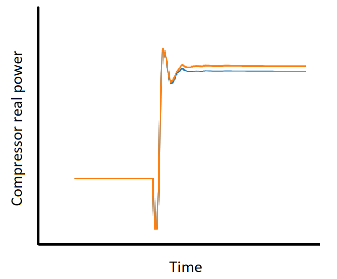

********************
Motor Stall (simple)
********************

Controller overview
-------------------

The simple motor stall model implements a simplified single-phase residential air conditioner stall model (motor type d).
The 'run' and 'stall' behaviors are modeled by simply converting the model type from constant power to constant impedance load.
When the voltage at the point of common coupling falls below 'v_stall', the model is converted to constant impedance 
(with p and q multiplier used to represent the jump in p and q consumption).
This mimics the stall bebahior of the motor reasonably well. 

In this implementation, stall and reconnect timers are implemented using stochastic variables instead of the transfer function 
implmented in the full model. This simpler models scales really well (tested with a hundred thousand instances on a single machine)
when compared to the complete motor stall model

Controller model
----------------

.. autopydantic_model:: PyDSS.pyControllers.models.MotorStallSimpleSettings

Usage example
-------------