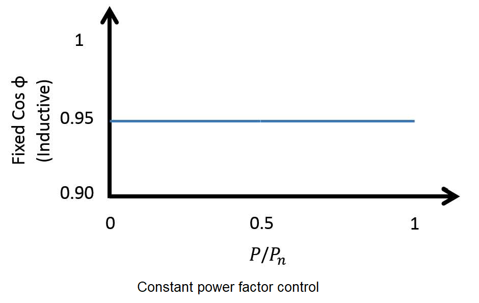
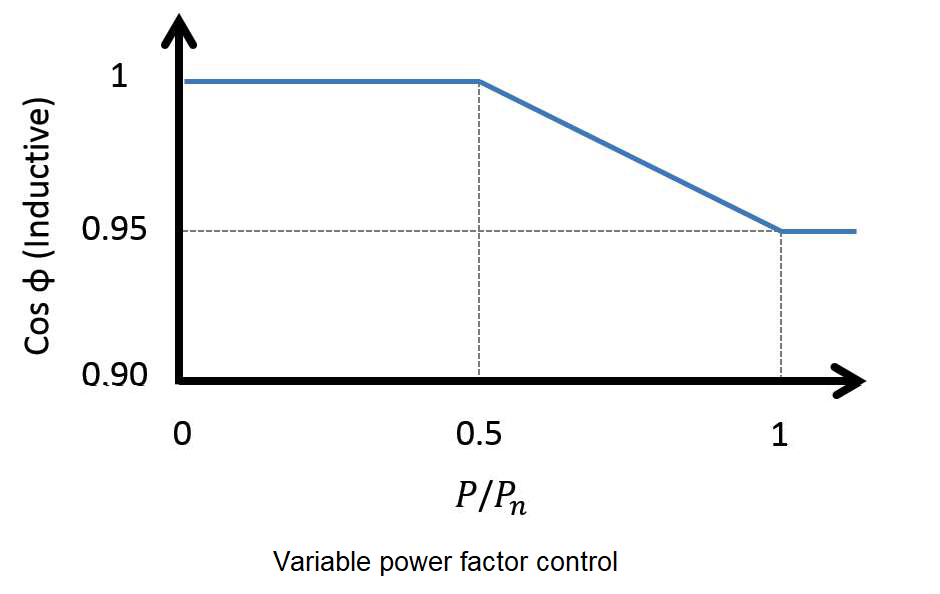
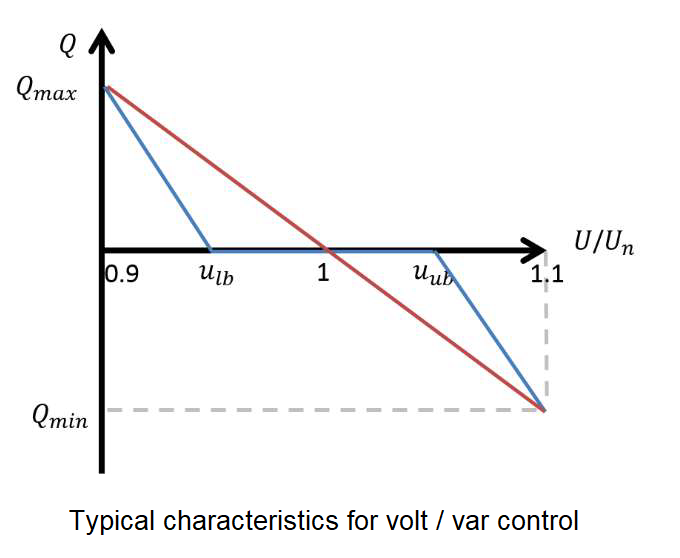
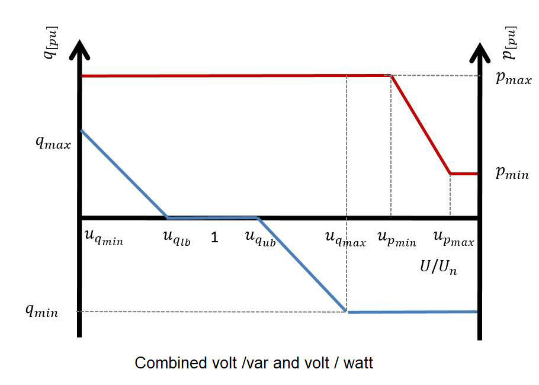

**************************
PV System Smart Controller 
**************************

Controller overview
-------------------

This controller implments three reactive power compensation techniques namely, 

- constant power factor mode
- variable power factor mode 
- voltage droop mode (a.k.a. volt / var control)

Additionally it implements the volt / watt control and finally implents the trip logic for legacy invereters.

In constant power factor mode, inverter reactive power follows its active power output, thus ensuring
power factor remains constant. Constant power factor control mode is cost effective as no
additional components are required and is simple to implement. However, constant power factor
control is an inherently inefficient compensation technique as reactive power is supplied not taking
into consideration the current state of the network.

Variable power factor control is another reactive power compensation method implemented in this controller. 
The idea is to operate the inverter
at unity power factor while output power is less than a preset fraction of the rated power of the
inverter. Once power generation exceeds the preset limit, power factor decreases linearly as a
function of inverter power output. At times of peak generation, power factor is at a minimum hence
the reactive power supply is maximum. This method is much more efficient when compared with
constant power factor mode.

Droop based reactive power compensation also known as Volt/VAR control is another
local reactive power compensation method that has been implmented in this controller implementation.
In this control method the amount of reactive power an inverter will absorb or inject is dependent
upon the voltage at the PCC. The contoller allows users to define different droop curves including linear, piece-wise linear
and non-linear curves. The advantage of having a dead band in Volt/VAR droop characteristics is
that, it minimizes unnecessary compensation when voltage is within the prescribed bounds. Volt/VAR droop
control is more efficient in voltage regulation compared to variable power factor control.

Active power curtailment algorithm has also been implemented in this controller implementation.
Active power curtailment (APC) reduces the amount of active power injected 
by the PV inverters linearly, as the voltage at their buses increase above a certain value. In this way, 
it is possible to increase the installed PV capacity and energy yield while preventing overvoltage.

Controller model
----------------

.. autopydantic_model:: pydss.pyControllers.models.PvControllerModel

Controller options
------------------

.. autoenum:: pydss.pyControllers.enumerations.SmartControls

.. autoenum:: pydss.pyControllers.enumerations.ControlPriority

.. autoenum:: pydss.pyControllers.enumerations.VoltWattCurtailmentStrategy

.. autoenum:: pydss.pyControllers.enumerations.VoltageCalcModes

Usage example
-------------