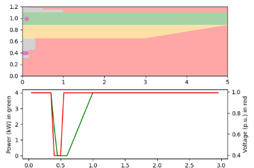
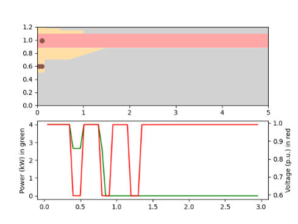
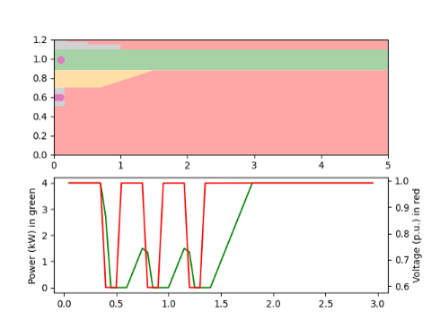

******************************
PV System Voltage Ride-Through
******************************

Controller overview
-------------------

This controller implements the voltage ride-through requirements from both IEEE 1547-2003 and the IEEE 1547-2018 standard.

The controller implements ride-through requirements in complete detail. This includes

- Implementation of inverter behaviour in defined regions such as may trip, current limited, permissive etc. 
- Implementation of inverter categories for the  IEEE 1547-2018 standard.
- System behavior under multiple disturbances.
- System recovery under momentary cessation and trip scenarios.

The figure above shows inverter response to a fault. 
The inverter is configured to provide 'momentary cessation' operation in the 'may trip' region. The inverter enter momentary 
cessation region (grey) and the PV is temporarily disconnected. Once the fault is cleared, the PV system goes back to full power 
in 0.4s in a ramped manner as per the per IEEE 1547-2018 standard

The figure above shows inverter response to multiple faults fault. The inverter is modeled to trip on multiple faults. 
As per the standard the inverter should trip on the second consecutive fault. After the first fault, PV system enter momentary 
cessation region and starts to recover. On the second fault, the PV system trips and is required to wait at least 300s before it can reconnect

The figure above shows inverter response to multiple faults fault. The inverter is modeled to NOT trip on multiple faults. 
With each fault, PV system enter momentary cessation region and starts to recover in  a ramped manner. 
It finally recovers after the third fault

Controller model
----------------

.. autopydantic_model:: PyDSS.pyControllers.models.PvVoltageRideThruModel

Controller options
------------------

.. autoenum:: PyDSS.pyControllers.enumerations.PvStandard

.. autoenum:: PyDSS.pyControllers.enumerations.VoltageCalcModes

.. autoenum:: PyDSS.pyControllers.enumerations.RideThroighCategory

.. autoenum:: PyDSS.pyControllers.enumerations.PermissiveOperation

.. autoenum:: PyDSS.pyControllers.enumerations.MayTripOperation

.. autoenum:: PyDSS.pyControllers.enumerations.MultipleDisturbances

.. autoenum:: PyDSS.pyControllers.enumerations.CategoryI

.. autoenum:: PyDSS.pyControllers.enumerations.CategoryII

.. autoenum:: PyDSS.pyControllers.enumerations.CategoryIII

Usage example
-------------
    see test_controllers.py in the tests folder
