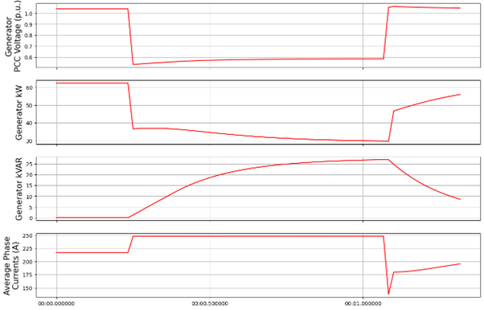

Dynamic Voltage Support Controller 
==================================
(DynamicVoltageSupport.py)

The DynamicVoltageSupport (DVS) controller will control the DER to
provide “rapid reactive power exchanges during voltage excursions” per
1547-2018 clause 6.4.2.6. The addition of DVS for DER objects may
improve system stability during faults and/or improve ride-through
capabilities for DERs.

The DynamicVoltageSupport controller works with OpenDSS **Generator**
objects and can be applied to one or more generators. Generator objects
must be **3ph** and must have the following parameters defined: **kV**,
**kVA**, **kW**, **kVAr**. The opendss generator model defined in the
opendss file does not matter when using this controller as it will be
overwritten by the controller upon initialization. The controller is
designed to **mimic the current-limited behavior of OpenDSS generator
model 7**. For comparison purposes, one can run a baseline simulation
without this controller using generator model 7. The response of this 
controller is designed for 3ph voltage sags or swells and assumes a 
balanced response from the generator objects. 

DVS can be used alone or can be coupled with the **PvVoltageRideThru**
controller (see notes below on required parameters). NOTE: An issue 
exists when generators re-enter service after a trip, which will be
resolved in future revisions. One can set the reconnect time to a value
longer than the simulation to ensure generators do not re-enter service
after a trip. This only works when not using momentary cessation (i.e. 
with Category III Voltage Ride Through)

Controller Assignment
---------------------

The controller may be assigned to DERs via the pydss registry.

Controller Settings .toml File
------------------------------

The following is an example of the required Settings.toml file for
implementing DVS control. Each of these fields must be defined and
linked in the controller registry.

| **Example Settings.toml file:**
| [DVS]
| “Trv” = 0.001
| “Tinv = 0.001
| “dbd1” = -0.12
| “dbd2” = 0.1
| “Kqv” = 100
| “iqh1” = 1.1
| “kvar_max” = 0.44
| “kvar_min” = -0.44
| “capacitive_support” = true
| “inductive_support” = true
| “post_fault_reset” = 1
| “overvoltage_kva_limited” = true
| “current_limited_error_tolerance” = 0.0001
| “Use with Voltage Ride Through” = false

| **Parameter Definitions:**
| **Trv** = Time-constant for voltage transducer. Use a smaller number
  for a faster DER response following a voltage event.
| **Tinv** = Time-constant for inverter controller. Use a smaller number
  for a faster change in active and reactive power values.
| **dbd1** = single-sided lower deadband (∆V p.u). DER will provide DVS
  when voltage drops below this threshold.
| **dbd2** = single-sided upper deadband (∆V p.u). DER will provide DVS
  when voltage rises above this threshold.
| **Kqv** = proportional gain constant. Use a larger value for a faster
  reactive power ramp.
| **iqh1** = current limit for injection (p.u). Typical is 1.1 p.u.
| **kvar_max** = max kvar injection (p.u). This should be a positive
  number. If set to 0.44, the DER will provide 44% of its nameplate
  rating as reactive power injection. Depending on the inverter headroom
  it will curtail active power to reach this.
| **kvar_min** = max kvar absorption (p.u). This should be a negative
  number. If set to -0.44, the DER will provide 44% of its nameplate
  rating as reactive power absorption. Depending on the inverter
  headroom it will curtail active power to reach this.
| **capacitive_support** = bool indicating if gen will provide
  capacitive support. If true, DER will inject reactive power during
  undervoltage events. If false, DER will take no action during
  undervoltage events.
| **inductive_support** = bool indicating if gen will provide inductive
  support.If true, DER will absorb reactive power during overvoltage
  events. If false, DER will take no action during overvoltage events.
| **post_fault_reset** = time (s) after fault before gen provides more
  support. This can be used to avoid cyclic behavior when voltages hover
  around the deadband values.
| **overvoltage_kva_limited** = bool indicating if gen is kva limited.
  If true, DER will be limited by it’s kva rating. This only makes a
  difference during overvoltage events (when the kva nameplate is more
  limiting than the current limit), or if the current limit is set below
  1.0
| **current_limited_error_tolerance** = error tolerance (%) when
  evaluating current limit adherance. Use a larger number to improve
  convergence. Larger numbers may result in more noticeable
  discrepancies between the current limit using OpenDSS Generator model
  7 and that implemented by this controller.
| **Use with Voltage Ride Through** = bool indicating if DVS controller
  is used in conjunction with the VRT controller. If the user is
  coupling this controller with the PvVoltageRideThru controller, this
  must be set to true. There is a an equivalent setting in the
  PvVoltageRideThru settings .toml file (‘Use with Dynamic Voltage
  Support’) to indicate it is being used alongside DVS controller, which
  also must be set to true.

Example Results (created using controller version 2.0)
======================================================

Undervoltage Event Baseline DVS Settings
----------------------------------------

| [DVS]
| “Trv” = 0.001
| “Tinv = 0.001
| “dbd1” = -0.12
| “dbd2” = 0.1
| “Kqv” = 100
| “iqh1” = 1.1
| “kvar_max” = 0.44
| “kvar_min” = -0.44
| “capacitive_support” = true
| “inductive_support” = true
| “post_fault_reset” = 1
| “overvoltage_kva_limited” = true
| “current_limited_error_tolerance” = 0.0001
| “Use with Voltage Ride Through” = false

Baseline Results
----------------

The results below show a single, 187 kVA DER’s DVS response to a simplified 
voltage sag lasting less than 1 sec with a minimum, sustained PCC voltage of 
about 0.6 p.u, and a simulation timestep of 1 cycle (0.0167 sec). We see an 
immediate increase in reactive power contributions in response to the voltage 
sag. Due to the DER enforcing its current limit and acting in VAR priority, 
we also see a coincident reduction in active power. The current limit (Iqh1) 
in this scenario is set to 1.1 p.u., leading to an increase in phase current 
of about 10%. The current limit is evaluated at the nominal voltage for the 
generator (0.48 kV) and is enforced in the simulation without any intentional 
delays. This instantaneous enforcement of the current limit is a reasonable 
approximation as inverters, whose solid-state switches are very sensitive to 
thermal overload, are generally capable of limiting current within a fraction 
of a cycle. The current increases during this simulated fault are also 
completely balanced, as inverters generally keep negative-sequence fault 
contributions to a minimum (following a very short, 1-2 cycle, transient 
period). The VAR contributions are limited by the kvar_max parameter at 
0.44 p.u or about 27 kVAR/phase. Overall, the response time here is very fast,
given the baseline time constants for the voltage transducer and inverter 
controller of about 1 millisecond.

|image1| 

Varying Trv: Trv=0.1
--------------------

In this scenario, we increase the time constant for our voltage transducer, 
essentially increasing the lag between when the system voltage drops and when 
the inverter registers this drop. As such, we see a largely similar response 
to our baseline, except with a short delay initially, and when the voltage 
returns to normal. As a result of this delay, we also see a large spike in 
current for a single timestep, given that the inverter does not limit current 
at the lower voltage, until it registers the lower PCC voltage. We can also 
more clearely see the impact on PCC voltage resulting from the inverter response, 
with a rise in PCC voltage of about 0.08 p.u. (compared to the lowest point 
of the initial sag) following the rapid reactive power injection. 

|image2|

Varying T_inv: Tinv=0.1
-----------------------

In this scenario, we return Trv to 0.001 s and instead increase the inverter 
controller time constant (Tinv) to 0.1. While the DER registers the voltage 
drop almost immediately, the inverter response is much slower. Increasing Tinv, 
reduces the response time of the inverter following a control input. Here we 
see an initial, rapid decrease in real power as a result of the inverter immediately 
enforcing its current limit. As reactive power contributions slowly climb, active 
power reduces further. Still, we enforce a current limit of 1.1 p.u. and a kVAR 
limit of 0.44 p.u.. Once the voltage returns to normal, we current drop below its 
pre-fault levels and slowly increase back to normal (if the simulation ran longer) 
as we reduce our kVAR contributions and proportionally increase our kW contributions. 

|image3|

Varying Kqv: Kqv=10
-------------------

In this scenario, we return both time constants (Trv and Tinv) to 0.001 s and 
instead reduce our gain constant from 100 to 10. This effectively slows down the 
rate at which kVAR contributions are increased (as provided to the inverter controller 
as an input signal). The inverter controller still reacts very quickly to the input 
signals, however the lower gain constant results in a slower, linear increase in kVAR 
contributions. This does not affect the speed that the inverter returns to pre-fault 
conditions after the fault. 

|image4|

Varying 1qh1: Iqh1=2.0
----------------------

Returning all other settings to the baseline, in this scenario we increase our 
current limit from 1.1 p.u. to 2.0 p.u. In the first set of plots below, we see 
a larger increase in current (~ 150 A increase vs. 30 A in our baseline). One 
will notice that this increase is not quite double the pre-fault current. While 
we don’t actually reach our user-defined current limit in this scenario, we instead 
hit our kVA limit of 1.0 p.u. and our kVAR limit  of 0.44 p.u.. Our generator’s kva 
parameter in the .dss file is set to the same value as its kw parameter (187 kVA). 
If you do the math during the fault (3*sqrt((27 kVAR**2)+(56 kW**2)), we get 187 kVA. 
At this PCC fault voltage of ~0.6 p.u., we will not see a further increase in DER 
contributions. If one were to rerun this scenario with a lower fault voltage, simulating 
a closer-in fault, one would see the same kVA contributions but with a larger current 
increase, closer to the 2.0 p.u. current limit. This is shown in the second plot below. 

|image5|

|image6|

Varying kvar_max: Kvar_max=1
----------------------------

Returning to the 0.6 p.u. fault voltage and baseline settings, here we increase 
kvar_max from 0.44 to 1.0 p.u. This represents a theoretical inverter, which can 
curtail 100% of real power to supply only reactive power. In the first set of results 
below, we see that kW drops to zero, as kVAR increases until the DER’s current limit 
of 1.1 is reached. In the second set of results below we use a current limit (iqh1) of 
2.0 and a kVAR limit (kvar_max) of 1.0 p.u. resulting in the DER supplying a kVAR 
value equal to the prefault kW value. 

|image7|

|image8|

UnderVoltage Overvoltage Event Baseline Settings
------------------------------------------------

| [DVS]
| "Trv" = 0.001
| "Tinv" = 0.001
| "dbd1" = -0.1
| "dbd2" = 0.1
| "Kqv" = 100
| "iqh1" = 1.1
| "kvar_max" = 0.44
| "kvar_min" = -0.44
| "capacitive_support" = true
| "inductive_support" = true
| "post_fault_reset" = 0
| "overvoltage_kva_limited" = true
| "current_limited_error_tolerance" = 0.001
| "Use with Voltage Ride Through" = false

Baseline Results
----------------

In the following scenarios we apply both and undervoltage (UV) and an overvoltage (OV) in 
quick succession, to demonstrate the ability of the DER to provide both capacitive and 
inductive support. Notice we also set the post_fault_reset period to 0 s, such that the 
inverter can provide dynamic voltage support for a second voltage event immediately following 
the first fault, with no intentional delay. Normally, setting a non-zero post_fault_reset, 
prevents oscillatory behavior when system voltages are very near the edge of the voltage 
deadband (dbd1 and dbd2). 
The results in our baseline simulation show that kVAR contributions increase during the 
UV event and decrease (absorbing) in the OV event. The UV event looks largely like the 
previous scenarios discussed above. During the OV event, we see a reduction in current 
contributions vs. pre-fault levels, indicating we are not current limited during the OV, 
but instead we are kVA-limited (set by the overvoltage_kva_limited Boolean parameter). 
We also see a reduction in active power for the sake of absorbing reactive power while 
maintaining a total kVA contribution of 187 kVA (3*sqrt((56 kW**2)+((-28)**2))). 

|image9|

Varying Capacitive Support: capacitive_support=False
----------------------------------------------------

By setting capacitive_support to False, we prevent the DER from providing capacitive 
support during an UV event. Instead the DER will simply operate in a current-limited manner, 
supplying only active power. This UV behavior is akin to using generator model 7 in OpenDSS. OV 
inductive support is unaffected by this parameter.

|image10|

Varying Inductive Support: inductive_support=False
--------------------------------------------------

Setting inductive_support to False, prevents the DER from providing inductive support during 
and OV event. UV capacitive support is unaffected by this parameter. 

|image11|

Combining DVS and VRT for a FIDVR Event
---------------------------------------
This PyDSS DVS controller can be used alone, or in conjunction with the PyDSS voltage ride-through 
(VRT) controller. Combining the two can be accomplished using the “Use with Voltage Ride Through” 
and “Use with Dynamic Voltage Support” parameters in the DVS settings .toml file and the VRT settings 
.tomly file, respectively. Below are results simulating 4 scenarios using 28 generators all with the 
same settings and controllers assigned. The simulated event is a fault induced voltage recovery 
(FIDVR) applied as a voltage profile at the slack bus. The four scenarios are as follows: 

| 1.	Baseline_No_Trip: A baseline scenario in which the generators are not utilizing DVS nor VRT 
(no controllers assigned). This provides a baseline amount of generation to compare other scenarios to.  
| 2.	NO_VRT: Generators are not utilizing DVS, and are instructed to trip instantaneously below 0.88 p.u. voltage. 
| 3.	NO_VRT_DVS: Generators are utilizing DVS, and are instructed to trip instantaneously below 0.88 p.u. voltage.
| 4.	NO_VRT_DVS_INACTIVE: Generators are assigned the DVS controller but with both capacitive 
support and inductive support disabled, and are instructed to trip instantaneously below 0.88 p.u. 
voltage. This is meant to show that there is alignment between the DVS-controller-initiated generator 
behavior, and OpenDSS’s generator model 7. 

The results show that 28/28 DERs trip offline in every scenario, due to the absence of any VRT 
capability. We see a reduction in average PCC voltages compared with baseline due to the loss 
of distributed generation. 

|image12|
|image13|
|image14|

In our second set of FIDVR results, we use IEEE 1547-2018 Category I VRT settings, coupled 
with the same DVS settings described in the scenarios above. Here we see that, with DVS activated 
(VRT_CAT_I_DVS), the generators all provide reactive power support, raising the average PCC voltage 
compared to the VRT_CAT_I_DVS_INACTIVE scenario. We also see that only 23/28 generators trip offline, 
due to the addition of DVS and the PCC voltage improvements that result from it. 

|image15|
|image16|
|image17|

.. |image1| image:: ./images/baseline_uv.png
.. |image2| image:: ./images/trv_0_1.png

.. |image5| image:: ./images/iqh1_2_1.png
.. |image6| image:: ./images/iqh1_2_2.png
.. |image7| image:: ./images/kvarmax_1_1.png
.. |image8| image:: ./images/kvarmax_1_2.png
.. |image9| image:: ./images/baseline_uvov.png
.. |image10| image:: ./images/capacitive_support_false.png

.. |image12| image:: ./images/no_vrt_fidvr_1.png
.. |image13| image:: ./images/no_vrt_fidvr_2.png
.. |image14| image:: ./images/no_vrt_fidvr_3.png

.. |image17| image:: ./images/vrt_cat1_fidvr_3.png

  